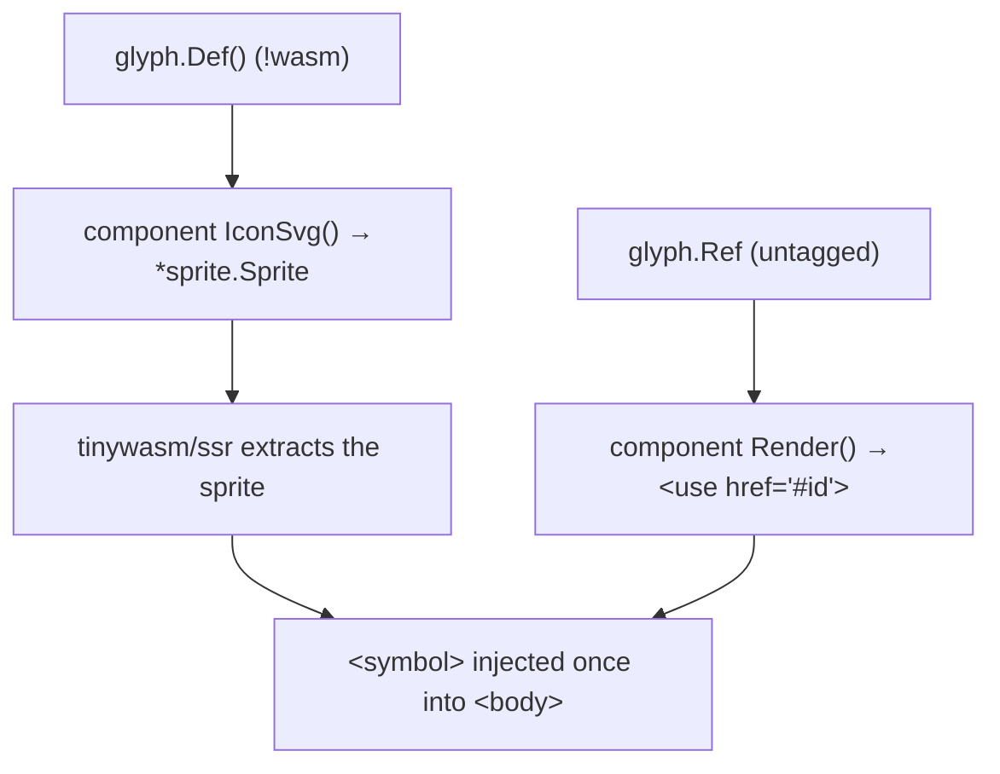

# Architecture

## The split

Every glyph package has exactly two source files (plus a test):

| File | Build tag | Exports | Reaches |
|---|---|---|---|
| `<glyph>.go` | *(none)* | `const Ref = svg.Icon("<id>")` | WASM **and** backend |
| `svg.go` | `//go:build !wasm` | `func Def() sprite.Definition` | backend / SSR only |

`Ref` is a `github.com/tinywasm/svg.Icon`, which is just a `string`. Rendering it
(`Ref.Render(class)`) produces `<svg class=...><use href="#<id>"/></svg>` — no
geometry, just a pointer to a symbol that SSR will have injected.

`Def()` returns a `github.com/tinywasm/svg/sprite.Definition` (id + viewBox +
`<path>` body). `sprite` serializes SVG through `tinywasm/json` +
`tinywasm/model`, so it must never enter a WASM build. The `//go:build !wasm`
tag on `svg.go` is what guarantees that: a component importing `trash` for
`trash.Ref` in its render code does not compile `trash/svg.go` at all.

## The shared builder

`github.com/tinywasm/icons` (the root package, itself `//go:build !wasm`) holds
one function:

```go
func Solid(ref svg.Icon, viewBox, d string) sprite.Definition
```

It is `sprite.Define(ref, viewBox, sprite.Path(d))` — the call every glyph's
`Def()` would otherwise repeat verbatim. It exists to keep the glyph-family
convention (one closed path, `fill="currentColor"`, FontAwesome-style viewBox)
in one place. Consumers never import root `icons`; only the glyph packages'
`svg.go` files do.

## How a consumer wires it



A component lists the glyphs it needs in its own `IconSvg()`; `ssr` collects
every `Definition`, dedups by id (`assetmin.MergeAll`, first occurrence wins),
and injects one `<symbol>` per id. Two components referencing `trash` yield one
symbol in the page.

## The pre-publish check

`svg/sprite` has no build tag of its own — it compiles for WASM too — so
forgetting `//go:build !wasm` on a `svg.go` does not fail the build, it
silently ships path data to the browser. The dependency-graph check is the only
thing that catches it:

```bash
GOOS=js GOARCH=wasm go list -deps ./trash ./pencil ./plus ./undo | grep tinywasm/svg/sprite   # MUST be empty
```
